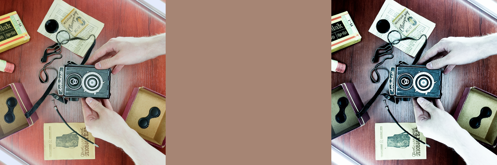

# I Invented a Brand New Blending Mode ([video](https://youtu.be/gM-Ja1gioj4?si=76GnDCkQ0mI1tT-4 "I Invented a Brand New Blending Mode. Try it yourself!"))
The blend mode takes values of the base layer, adds the luminosity value of the base layer to it, and subtracts values of the top layer. As described in the video, while trying to recreate standard "Luminosity" blend mode, I skipped RGB-to-HSL conversion. Surprisingly, this "error" created a unique effect.

# $𝑓(a, b) = a + Lum_a - b$
where:
- **$`a`$** is the base layer value;
- **$`Lum_a`$** is the base layer luminance value;
- **$`b`$** is the top layer value.
> [!NOTE]
> To calculate luminance, I used the next formula $`0.2126*R + 0.7152*G + 0.0722*B`$

Its most effective use case involves pairing a base image layer with a uniformly filled top layer representing the base image's average color value. This configuration produces a distinctive visual effect reminiscent of the high-contrast, desaturated aesthetic characteristic of bleach bypass processing (see examples below).

The blend mode is currently only available in my DCTLs for DaVinci Resolve Studio ([FX Trippy DCTL](https://aescripts.com/fx-trippy-dctl/ "FX Trippy DCTL on the aescripts") and [FX Grainny DCTL](https://aescripts.com/fx-grainny-dctl/ "FX Grainny DCTL on the aescripts")), making it tricky to test with complex layer combinations. It's a hidden gem for color nerds willing to experiment, I hope.

## Examples

